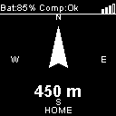
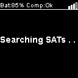
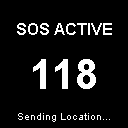

# Bring Em Home 🧭

A dedicated GPS navigation device designed to guide Emilie safely back to her starting location on every hike using GPS-breadcrumbs. It also serves as an emergency LoRa-beacon and SOS-flasher in case she needs help.

## Overview

This device uses GPS and compass sensors to help navigate back to a saved "home" position. Perfect for hikers who want peace of mind knowing they can always find their way back to their starting point.

## Hardware Requirements

- **Heltec Wireless Tracker (V1.1)**
  - Integrated ESP32-S3, SX1262 LoRa, and UC6580 GNSS.
- **1.5" OLED Display**
  - SH1107 Driver, 128x128 resolution, I2C interface.
- **Bosch BNO055 9-Axis Absolute Orientation Sensor**
  - For precise compass heading.
- **Peripherals (Optional)**
  - Vibration Motor with driver circuit
  - Flashlight and SOS-signal LED with driver circuit for high power LEDs
  - External Button, waterproof

## Hardware Connections

I've chosen a Heltec Wireless Tracker v1.1 integrates most components, simplifying the wiring significantly.

### I2C Bus (Shared: BNO055 Compass & SH1107 OLED)
- **SDA**: GPIO 41
- **SCL**: GPIO 42
- **VCC**: 3.3V
- **GND**: GND

### Peripherals
- **Button**: GPIO 6 (External)
- **Vibration Motor**: GPIO 7
- **Flashlight LED**: GPIO 5
- **Status LED (NeoPixel)**: GPIO 18 (Internal WS2812)

## Features

- ✅ **Intuitive UI**: Intuitive graphical interface with GPS signal bars and battery status.
- ✅ **Smart Auto-Home-Position**: Automatically sets home position on power-up when GPS fix is found.
- ✅ **Crash Recovery**: Restores home position and breadcrumbs if device restarts due to software error.
- ✅ Save home position manually with button press (Long Press > 10s)
- ✅ **Smart Breadcrumbs**: Records path points every 250m OR on significant direction changes (to capture turns accurately).
- ✅ **Smart GPS Filter**: Ignores GPS drift when standing still or moving too fast (>12km/h).
- ✅ **Safety First**: SOS Beacon with LoRa transmission, Morse code flasher, and battery runtime estimation.
- ✅ **Charging Detection**: Automatically detects wall charger and shows charging progress.
- ✅ Backtracking mode to retrace steps
- ✅ Calculate distance to home/waypoint
- ✅ Digital compass (North Arrow)
- ✅ Visual navigation arrow (Target Arrow)
- ✅ Persistent storage of home position
- ✅ Low power consumption (Auto-off)

## Configuration

You can customize the device settings in `include/config.h`. This includes hardware pins, timeouts, and **User Data** for the SOS message.

**User Data Options:**
- `USER_BLOOD_TYPE`: Your blood type (e.g., "A+").
- `USER_GENDER`: Your gender (e.g., "female"). *Optional: Comment out to disable.*
- `USER_BIRTH_YEAR`: Your birth year (e.g., 1984). The device calculates age automatically from GPS time. *Optional: Comment out to disable.*
- `USER_MED_ALLERGIES`: Medication allergies (e.g., "Penicillin"). *Optional: Comment out to disable.*

**Navigation Settings:**
- `BREADCRUMB_DIST`: Distance between regular breadcrumbs (default: 250m).
- `BREADCRUMB_TURN_THRESHOLD`: Angle change to trigger a smart breadcrumb (default: 45°).
- `BREADCRUMB_MIN_DIST_TURN`: Minimum distance moved before checking for a turn (default: 20m).
- `MAX_BREADCRUMBS`: Maximum number of stored points (default: 1000).

These details are included in the LoRa SOS beacon to assist rescue teams.

## User Interface

The device features a high-contrast OLED display designed for readability in sunlight.

### 1. Navigation Screen
Shows the direction to Home (or next waypoint), current compass heading, and distance.
- **Header**: Vertical Battery Icon, Compass Status (C:Ok), Satellite Signal.
- **Center**: Navigation Arrow (Points to destination) with 8 Cardinal Directions (N, NE, E, SE, S, SW, W, NW). Intermediate directions are shown as dots.
- **Footer**: "HOME" label (Left) and Distance in km (Right).



### 2. Searching for GPS
Displayed when no GPS fix is available. Shows "Searching SATs" with an animated progress bar.



### 3. SOS Mode
Activated by 5 rapid clicks. 
1.  **Countdown**: A 5-second countdown allows you to cancel accidental triggers.
2.  **Active**: Displays a huge countdown to the next LoRa transmission.
3.  **Runtime**: Shows estimated battery runtime based on current consumption.




### 4. Charging Mode
Displayed when connected to a charger (Voltage > 4.4V). 
- Shows "Loading battery..." and an animated battery icon.
- Displays **Estimated Time to Full** (e.g., "Est: 1.5h").


### 5. OTA Update Mode
Activated by holding the button for **5 seconds** while powering on.
- Creates a WiFi Access Point: `Bring_Em_Home` (No Password).
- Connect and visit `192.168.4.1` to upload new firmware (`firmware.bin`) or filesystem (`littlefs.bin`).
- **Indicator**: The Status LED pulses **White**.


## 🔋 Power & Battery Life

The device is optimized for long hikes. It uses dynamic CPU frequency scaling (240MHz active / 80MHz eco) and auto-display timeout.

**Settings:**
- **Display Timeout:** 120 seconds (configurable in `src/config.h`)
- **Status LED:** 40% Brightness
- **CPU:** Auto-throttling when display is off.
- **LoRa SOS:** Transmits every 60 seconds (in SOS mode).

| Battery Capacity | Hiking Mode (Avg. Consumption ~90mA) | SOS Mode (Avg. Consumption ~220mA) |
| :--- | :--- | :--- |
| **1500 mAh** | **~14 Hours** | **~5.5 Hours** |
| **2000 mAh** | **~19 Hours** | **~7.5 Hours** |
| **3000 mAh** | **~28 Hours** | **~11 Hours** |

*> Note: Estimates include a 15% safety margin for converter losses and battery aging.*

### Low Battery Warning
When the battery drops below 10%:
- **Vibration**: The device vibrates 3 times immediately upon reaching 10%.
- **LED Signal**: The small status LED flashes yellow every 10 seconds.
- **Display**: The battery icon in the top-left corner appears empty.

## Getting Started

1. **Assemble Hardware**: Connect the OLED and BNO055 to the I2C pins (41/42).
2. **Flash Firmware**: Use PlatformIO to upload the code.
3. **Go Outside**: The device needs a clear view of the sky to get a GPS lock.
4. **Set Home**: Long-press the button to save your current location as "Home".
5. **Navigate**: Follow the arrow on the display to return.

## Software Setup

### Prerequisites
- [PlatformIO](https://platformio.org/) (recommended) or Arduino IDE
- USB drivers for ESP32-S3

### Building with PlatformIO

1. Clone this repository:
   ```bash
   git clone https://github.com/TechwriterSSchmidt/Bring_Em_Home.git
   cd Bring_Em_Home
   ```

2. Build the project:
   ```bash
   pio run
   ```

3. Upload to the ESP32-S3:
   ```bash
   pio run --target upload
   ```

4. Monitor serial output:
   ```bash
   pio device monitor
   ```

### Building with Arduino IDE

1. Install the following libraries via Library Manager:
   - TinyGPSPlus
   - GFX Library for Arduino (MoonOnOurNation)
   - Adafruit BNO055
   - Adafruit Unified Sensor

2. Select Board: "ESP32S3 Dev Module"
3. Set partition scheme to default
4. Open `src/main.cpp` and upload

## Usage

### First Time Setup

1. **Power On**: Switch the device ON using the physical switch.
2. **Wait for GPS**: The device will automatically search for satellites.
3. **Auto-Save**: As soon as a valid GPS fix is obtained, the current location is **automatically saved as Home**.
   - The screen will show **"HOME SET!"**.
   - No button press is required.

### Navigation

- The screen displays:
  - **Distance** to home (in meters or km). *Note: This is the total path distance along your breadcrumbs, not just "as the crow flies".*
  - **Direction Arrow** pointing towards home relative to your current heading
  - **Breadcrumb Count**: Number of auto-saved waypoints (saved every 250m)
- Follow the arrow to return to your starting point.

### Navigation Modes

The device has two modes, toggled by a **Double Click** on the button:

1.  **Explorer Mode (Default)**
    *   **Compass Arrow**: Points to **North**.
    *   **Display**: Shows distance to Home.
    *   **Action**: Automatically saves breadcrumbs every 250m.

2.  **Bring me home! Mode**
    *   **Target Arrow**: Points to the **Next Waypoint** or **Home**.
    *   **Display**: Shows distance to the target.
    *   **Action**: Guides you back along your path.

### Power Saving

- The display automatically turns off after **5 minutes** of inactivity.
- **Single Click** the button to toggle the display ON or OFF.
- Turning the display ON resets the 5-minute timer.

### Navigation Indicators

The display shows:
- **GPS Status**: Satellite count
- **Coordinates**: Real-time Lat/Lon at the bottom
- **Compass Heading**: Current direction (0-360°)
- **Distance**: To Home or Next Waypoint
- **Visual Arrow**: 
    - **Explorer Mode**: North Indicator
    - **Bring me home! Mode**: Direction to Target

### Finding Your Way Home

1. **Double Click** the button to enter **Bring me home! Mode** (Screen shows "BRING ME HOME!").
2. Follow the **Arrow**.
3. The device will guide you from waypoint to waypoint until you reach Home.

## Display Layout

- **Top Bar**: Status Icons (SOS, Light), Satellite Count, Calibration
- **Center**: Main Navigation Info (Arrow, Distance)
- **Bottom**: Coordinates / Status Messages

## Troubleshooting

### GPS Not Locking
- Ensure you're outdoors with clear view of sky
- GPS may take 1-5 minutes for initial lock
- Avoid urban canyons, dense forests, or indoor use
- Check GPS module connections

### Compass Reading Incorrect
- Keep device away from magnetic materials (metal, speakers, motors)
- Calibrate by moving device in figure-8 pattern
- Check I2C connections to HMC5883L

### Display Not Working
- Check power supply (USB should provide 5V)
- Verify backlight is enabled
- Check SPI connections

### Home Position Not Saving
- Ensure GPS has valid lock before saving
- Check that flash memory is not full
- Try power cycling the device

## Technical Details

### GPS Specifications
- Update rate: 1-10 Hz
- Accuracy: ~2.5m CEP
- Cold start time: ~30s
- Warm start time: ~2s

### Compass Specifications
- Resolution: 0.73 mGauss
- Range: ±8 Gauss
- Accuracy: 1-2° heading accuracy

## Future Enhancements

- [ ] Add target coordinates via captive portal
- [ ] Add altitude display
- [ ] Speed and time estimates

## Contributing

Feel free to open issues or submit pull requests for improvements!

## License

This project is open source. Feel free to use and modify as needed.

## Support my projects

Your tip motivates me to continue developing nerdy stuff for the DIY community. Thank you very much for your support!

[](https://ko-fi.com/D1D01HVT9A)

## Credits

Created to help Emilie find her way home on hikes! 🏔️➡️🏠
