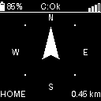
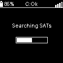
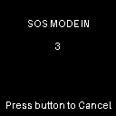
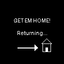
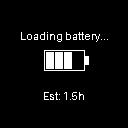

# Bring Em Home 🧭

A dedicated GPS navigation device designed to guide Emilie safely back to her starting location on every hike using GPS-breadcrumbs. It also serves as an emergency LoRa-beacon and SOS-flasher in case she needs help.

## Overview

This device uses GPS and compass sensors to help navigate back to a saved "home" position. Perfect for hikers who want peace of mind knowing they can always find their way back to their starting point.

## Support my projects

Your tip motivates me to continue developing nerdy stuff for the DIY community. Thank you very much for your support!

## Hardware Requirements

- **Heltec Mesh Node T114 (nRF52840)**
  - Ultra-low power nRF52840 MCU, SX1262 LoRa, and L76K GNSS.
  - Replaces the older ESP32-S3 version for vastly improved battery life.
- **1.5" OLED Display**
  - SH1107 Driver, 128x128 resolution, I2C interface.
- **Bosch BNO055 9-Axis Absolute Orientation Sensor**
  - For precise compass heading.
- **Peripherals (Optional)**
  - Vibration Motor
  - Flashlight LED
  - External Button

## Hardware Connections (Heltec T114)

### I2C Bus (Shared: BNO055 Compass & SH1107 OLED)
- **SDA**: Pin 16 (P0.16)
- **SCL**: Pin 13 (P0.13)
- **VCC**: 3.3V (Controlled by VEXT)
- **GND**: GND

### Peripherals
- **Button**: Pin 42 (P1.10) - Active Low
- **Vibration Motor**: Pin 36 (P1.04)
- **Flashlight LED**: Pin 38 (P1.06)
- **WS2812 LED**: Pin 40 (P1.08) - External Status LED
- **Battery Voltage**: Pin 4 (P0.04 / AIN2)
- **Battery Control**: Pin 6 (P0.06) - Voltage Divider Enable

## Power Management (New!)

The device now features a **Deep Sleep** mode that consumes negligible power (< 50µA), allowing the battery to last for months/years in standby.

- **Turn ON**: Hold Button for **3 Seconds** (Rising Vibration: Short-Short-Long).
- **Turn OFF**: Hold Button for **3 Seconds** (Falling Vibration: Long-Short-Short).
- **Wake Up**: Single click wakes the device from sleep (if not fully powered down).
- **Charging Detection**: Checks for charger connection every 1s for the first 5 minutes after boot, then stops to save power.

### Estimated Battery Life (2000mAh LiPo)

| Mode | Current Draw | Estimated Runtime |
|------|--------------|-------------------|
| **Active (Hiking)** | ~70 mA | ~28 Hours |
| **Deep Sleep** | < 0.1 mA | > 1 Year |
| **SOS Mode** | ~220 mA (Peak) | ~9 Hours |

## Performance & Stability

- **Non-Blocking Logic**: All critical systems (LEDs, Vibration, LoRa) use non-blocking state machines to ensure the main loop never freezes.
- **10Hz Display Limit**: The screen refresh rate is capped at 10Hz (100ms) to prioritize GPS data processing and prevent buffer overflows.
- **Sensor Startup**: Optimized boot sequence ensures sensors (BNO055, GPS) are fully powered before initialization.

## Features

- **Intuitive UI**: Intuitive graphical interface with GPS signal bars and battery status.
- **Smart Auto-Home-Position**: Automatically sets home position on power-up when GPS fix is found.
- **Crash Recovery**: Restores home position and breadcrumbs if device restarts due to software error.
- **Auto-Calibration Storage**: Automatically saves compass calibration data to Flash memory once fully calibrated, eliminating the need to recalibrate on every startup.
- Save home position manually with button press (Long Press > 10s)
- **Smart Breadcrumbs**: Records path points distance-based AND on significant direction changes (to capture turns).
- **Smart GPS Filter**: Ignores GPS drift when standing still or moving too fast (>12km/h).
- **Safety First**: SOS Beacon with LoRa transmission, Morse code flasher, and battery runtime estimation.
- **Charging Detection**: Automatically detects wall charger and shows charging progress.
- **Return Mode**: Backtracking mode to retrace steps.
- Calculate distance to home/waypoint
- Digital compass (North Arrow)
- Visual navigation arrow (Target Arrow)
- Persistent storage of home position
- Low power consumption (Auto-off)

## Configuration

You can customize the device settings in `include/config.h`. This includes hardware pins, timeouts, and **User Data** for the SOS message.

### Default Settings Table

| Parameter | Value | Description |
| :--- | :--- | :--- |
| **Navigation** | | |
| `BREADCRUMB_DIST` | `100.0` m | Distance between regular breadcrumbs |
| `MAX_BREADCRUMBS` | `8500` | Max number of stored waypoints (~850km range) |
| `MIN_SPEED_KPH` | `1.0` km/h | Min speed to record (prevents GPS drift) |
| `MAX_SPEED_KPH` | `12.0` km/h | Max speed (prevents glitches) |
| `BREADCRUMB_TURN_THRESHOLD` | `45.0` ° | Angle change to trigger smart breadcrumb |
| `BREADCRUMB_MIN_DIST_TURN` | `20.0` m | Min distance to check for turns |
| **Power & Timing** | | |
| `DISPLAY_TIMEOUT` | `120000` ms | Display auto-off time (2 minutes) |
| `LORA_TX_INTERVAL` | `60000` ms | SOS Beacon interval (1 minute) |
| `BAT_CHECK_INTERVAL_ACTIVE` | `60000` ms | Battery check interval (Display ON) |
| `BAT_CHECK_INTERVAL_IDLE` | `300000` ms | Battery check interval (Display OFF) |
| `CHARGE_CHECK_INTERVAL` | `3000` ms | Charger detection polling rate |
| `CHARGE_CHECK_DURATION` | `300000` ms | Time to poll for charger after boot (5 mins) |

**User Data Options:**
- `USER_BLOOD_TYPE`: Your blood type (e.g., "A+").
- `USER_GENDER`: Your gender (e.g., "female"). *Optional: Comment out to disable.*
- `USER_BIRTH_YEAR`: Your birth year (e.g., 1992). The device calculates age automatically from GPS time. *Optional: Comment out to disable.*
- `USER_MED_ALLERGIES`: Medication allergies (e.g., "Penicillin"). *Optional: Comment out to disable.*

These details are included in the LoRa SOS beacon to assist rescue teams.

## User Interface

The device features a high-contrast OLED display designed for readability in sunlight.

### 1. Explorer Mode (Default)
Shows the direction to Home (or next waypoint), current compass heading, and distance.
- **Header**: Vertical Battery Icon, Compass Status (C:Ok), Satellite Signal.
- **Center**: Navigation Arrow (Points to destination) with 8 Cardinal Directions (N, NE, E, SE, S, SW, W, NW). Intermediate directions are shown as dots.
- **Footer**: "HOME" label (Left) and Distance in km (Right).

### 2. Breadcrumb Mode (Backtracking)
Activated by a **Double Click**. Guides you back to your starting point by following your recorded path in reverse.
- **Header**: Same as Explorer Mode.
- **Center**: Direction Arrow pointing to the **Next Waypoint**. (No cardinal directions shown).
- **Footer**: "WAYPOINT" label (Left) and Distance to it (Right).

### 3. Searching for GPS
Displayed when no GPS fix is available. Shows "Searching SATs" with an animated progress bar.

### 4. SOS Mode
Activated by 5 rapid clicks. 
1.  **Countdown**: A 5-second countdown allows you to cancel accidental triggers.
2.  **Active**: Displays a huge countdown to the next LoRa transmission.
3.  **Runtime**: Shows estimated battery runtime based on current consumption.

### 5. Charging Mode
Displayed when connected to a charger (Voltage > 4.4V). 
- Shows "Loading battery..." and an animated battery icon.
- Displays **Estimated Time to Full** (e.g., "Est: 1.5h").

### 6. OTA Update Mode
Activated by holding the button for **5 seconds** while powering on.
- Creates a WiFi Access Point: `Bring_Em_Home` (No Password).
- Connect and visit `192.168.4.1` to upload new firmware (`firmware.bin`) or filesystem (`littlefs.bin`).
- **Indicator**: The Status LED pulses **White**.

## 🔋 Power & Battery Life

The device is optimized for long hikes. It uses dynamic CPU frequency scaling (240MHz active / 80MHz eco) and auto-display timeout.

**Settings:**
- **Display Timeout:** 120 seconds (configurable in `src/config.h`)
- **Status LED:** 40% Brightness
- **CPU:** Auto-throttling when display is off.
- **LoRa SOS:** Transmits every 60 seconds (in SOS mode).

| Battery Capacity | Hiking Mode (Avg. Consumption ~90mA) | SOS Mode (Avg. Consumption ~220mA) |
| :--- | :--- | :--- |
| **1500 mAh** | **~14 Hours** | **~5.5 Hours** |
| **2000 mAh** | **~19 Hours** | **~7.5 Hours** |
| **3000 mAh** | **~28 Hours** | **~11 Hours** |

*> Note: Estimates include a 15% safety margin for converter losses and battery aging.*

### Low Battery Warning
When the battery drops below 10%:
- **Vibration**: The device vibrates 3 times immediately upon reaching 10%.
- **LED Signal**: The small status LED flashes yellow every 10 seconds.
- **Display**: The battery icon in the top-left corner appears empty.

## Software Setup

### Prerequisites
- [PlatformIO](https://platformio.org/) (recommended)
- USB drivers for ESP32-S3

## Usage

### Navigation

- The screen displays:
  - **Distance** to home (in meters or km). *Note: This is the total path distance along your breadcrumbs, not just "as the crow flies".*
  - **Direction Arrow** pointing towards home relative to your current heading
  - **Breadcrumb Count**: Number of auto-saved waypoints (saved every 250m)
- Follow the arrow to return to your starting point.

### Navigation Modes

The device has two modes, toggled by a **Double Click** on the button:

1.  **Explorer Mode (Default)**
    *   **Compass Arrow**: Points to **North**.
    *   **Display**: Shows distance to Home.
    *   **Action**: Automatically saves breadcrumbs every 250m.

2.  **Bring me home! Mode**
    *   **Target Arrow**: Points to the **Next Waypoint** or **Home**.
    *   **Display**: Shows distance to the target.
    *   **Action**: Guides you back along your path.

### Power Saving

- The display automatically turns off after **5 minutes** of inactivity.
- **Single Click** the button to toggle the display ON or OFF.
- Turning the display ON resets the 5-minute timer.

*> Note: Checkout the [Quick Reference](Docs/QUICK_REFERENCE.md) for more information.*

## Technical Details

### GPS Specifications
- Update rate: 1-10 Hz
- Accuracy: ~2.5m CEP
- Cold start time: ~30s
- Warm start time: ~2s

### Compass Specifications
- Resolution: 0.73 mGauss
- Range: ±8 Gauss
- Accuracy: 1-2° heading accuracy

## Future Enhancements

- [ ] Add target coordinates via captive portal
- [ ] Add altitude display
- [ ] Speed and time estimates

## Contributing

Feel free to open issues or submit pull requests for improvements!

## License

This project is open source. Feel free to use and modify as needed.

## Credits

Created to help Emilie find her way home on hikes!
