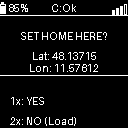

# Bring Em Home 🏠

A dedicated GPS navigation device designed to guide Emilie safely back to her starting location on every hike using GPS-breadcrumbs and a dead-simple single-button UI.

## Overview

This device uses GPS and compass sensors to find its way back to a stored “starting position.” It is ideal for hikers who want to be sure they can always find their way back to their starting point, e.g., in poor visibility, in pitch darkness, or if they get lost in bad weather.

## Table of Contents
- [Quick Start Guide](Docs/QUICK_REFERENCE.md)
- [Release Notes](RELEASE_NOTES.md)
- [Hardware Requirements](#hardware-requirements)
- [Hardware Connections (SuperMini nRF52840)](#hardware-connections-supermini-nrf52840)
- [Power Management & Optimization](#power-management--optimization)
- [Features](#features)
- [System Hardening](#system-hardening-measures-robustness-update)
- [License](#license)

## Hardware Requirements

- **SuperMini nRF52840** (Nice!Nano form factor compat.)
  - Tiny, powerful nRF52840 MCU.
- **Quescan M10FD (u-blox M10) GNSS Module**
  - High-performance, ultra-low power GPS/Galileo/GLONASS/BeiDou receiver.
- **1.5" OLED Display**
  - SH1107 Driver, 128x128 resolution, I2C interface.
- **Bosch BNO085 IMU**
  - High-precision VR-grade absolute orientation sensor.
- **WS2812B RGB LED**
  - External status LED for visual feedback without screen.
- **Lithium Polymer Battery**

## Hardware Connections (SuperMini nRF52840)

See [Docs/SCHEMATIC.txt](Docs/SCHEMATIC.txt) for detailed wiring diagrams.

### I2C Bus (OLED + Compass)
- **SDA**: P0.22
- **SCL**: P0.20

### GPS Module
- **RX**: P0.08
- **TX**: P0.06

### User Interface
- **Button**: P0.15 (Main User Input)
- **Vibration Motor**: P0.13
- **RGB LED**: P0.29 (External data line)

## User Interface & Usage

### Visual Guide

| Mode | Screen | Description |
| :--- | :---: | :--- |
| **Searching** |  | Device is acquiring GPS signals. Wait for lock. |
| **Confirm Home** |  | **1x Click:** Set new Home (Here). **2x Click:** Load saved Home. |
| **Navigation** |  | **Explore:** Shows Compass & Stats. **Arrow:** Points to Home/Target. |
| **Return Mode** |  | **Backtrack:** Follow arrow to nearest breadcrumb. **Distance:** Shows dist to next WP. |
| **Get Em Home** |  | **Hold >3s** to Toggle Mode. Guides you back to Start. |

### Button Controls (Single Button)

The device is operated entirely with a single button.

| Context | Action | Function |
| :--- | :--- | :--- |
| **Screen OFF** | **1 Click** | Wake up display. |
| **Screen ON** | **1 Click** | Cycle Menu Options (Switch Mode -> Change Dist -> Power Off). |
| **Menu: Dist** | **Hold (1s)** | **Change Distance:** Cycle 25m -> 50m -> 75m (Default: 25m). |
| **Menu Active** | **Hold (1s)** | Execute the displayed option (Explore/Return, or Power Off). |
| **Any Time** | **Hold (3s)** | **GET EM HOME:** Toggle between Explore and Return Mode. |
| **Startup** | **1x / 2x Click** | Confirm Home Location (1x = New, 2x = Load). |

### Status LED (Visual Feedback)

The external RGB LED (connected to P0.29) provides status information, allowing you to check the device state even when the screen is off (saving power):

| Color | Pattern | Meaning |
| :---: | :--- | :--- |
| **🔴 Red** | **Pulsing** | **Searching for Satellites** (No GPS Fix). |
| **🟢 Green** | **Short Blink (4s)** | **Recording.** GPS is fixed, Breadcrumbs are being saved. |
| **🟡 Yellow** | **Flash (10s)** | **Low Battery** (< 10%). Charge soon! |
| **⚪ White** | **Pulsing** | **Charging** (When connected to USB). |

## Power Management & Optimization

The device features an advanced power management system centered around the **nRF52840's Deep Sleep** capabilities.

### Power Saving Strategy

| Feature | Configuration | Optimization Benefit |
| :--- | :--- | :--- |
| **GPS Throttling** | **1-2 Hz** | Powers down the RF stage between fixes. |
| **Sensor Fusion** | **10 Hz** | Reduces I2C traffic to minimum needed for smooth UI. |
| **Smart Wake** | **IMU-Based** | Display wakes when **lifted/flat** (< 35° tilt) and sleeps fast (2s) when **hanging** (> 35° tilt) to save battery. |
| **Smart Display** | **Auto-Off** | Automatically creates deep-sleep windows for the OLED when not actively navigating. |
| **File System** | **LittleFS** | Efficiently stores breadcrumbs to Flash memory (persists through reboot). |

### Estimated Runtimes

Calculated based on average power consumption of ~15mA (Screen Off, GPS Active) and ~20mA (Active Navigation with **Smart Wake** enabled, approx. 20% active screen time).

| Battery Capacity | Screen Off (Tracking Only) | Active Navigation (Smart Wake) | Continuous Screen On |
| :--- | :--- | :--- | :--- |
| **1000 mAh** | ~66 Hours | **~50 Hours** | ~28 Hours |
| **1200 mAh** | ~80 Hours | **~60 Hours** | ~34 Hours |
| **1500 mAh** | ~100 Hours | **~75 Hours** | ~42 Hours |
## Features

- **Smart "Lift-to-Wake"**: Uses the IMU to automatically turn the display ON when looked at (held flat) and OFF when hanging by the side, maximizing battery life.
- **Compass Navigation**: Tilt-compensated heading to home/waypoint.
- **Breadcrumb Trail**: Automatically drops digital breadcrumbs to trace your path back.
  - **Storage:** Up to **5000 points** (~125 km range @ 25m, >350km @ 75m).
  - **Adjustable Density:** Select between **25m**, **50m**, or **75m** spacing via the on-device menu.
- **Persistent Storage**: Never lose your home point or path if power fails (saved to Internal Flash).
- **Return Logic**: Guidance back to the nearest previous point, then the next, retracing your steps.
- **Simple UI**: Designed for ease of use under stress (Quick Return, High Contrast).

## System Hardening Measures (Robustness Update)

The firmware includes several "fail-safe" mechanisms to ensure reliability in critical outdoor scenarios:

1.  **Crash Recovery (Watchdog)**
    *   **Mechanism:** An independent hardware timer resets the system if the software hangs for >10 seconds.
    *   **State Persistence:** The system continuously saves its Mode (Explore/Return) and target index. If a watchdog reset occurs, it wakes up and **immediately resumes** the mission (e.g., "Return Mode") instead of booting into idle.

2.  **Data Integrity (Atomic Writes)**
    *   **Risk:** Power loss during a file write (e.g., battery dies while saving Home) could corrupt data.
    *   **Solution:** All critical data (`home.txt`, `state.txt`) uses an **atomic write strategy**. Data is written to a temporary file (`.tmp`) first, verified, and then atomically renamed. This ensures files are either fully updated or remain at their last valid state.

3.  **Smart GPS & IMU Filtering**
    *   **Motion Gating (IMU):** To solve "Stationary Drift" (GPS wandering while sitting still), the device checks the **Linear Acceleration** sensor. Coordinates are ONLY saved if the device physically detects movement (`> 0.3 m/s²`).
    *   **Drift Protection:** Breadcrumbs are only recorded if GPS speed is > 0.5 km/h.
    *   **Quality Gate:** Points are rejected if HDOP (Signal Precision) is > 2.5, ensuring only reliable coordinates are stored.

4.  **Hardware & Input Stability**
    *   **Button Debouncing:** A software filter (50ms) eliminates noise from the physical button, preventing accidental double-clicks.
    *   **Compass Quality Monitor:** The UI displays a `CAL` warning if the BNO085/55 reports low calibration status, alerting the user that the arrow might be inaccurate until the device is moved in a figure-8 pattern.

## License

This project is licensed under the **PolyForm Noncommercial License 1.0.0**.

- **Noncommercial Use**: You may use this software for personal, educational, or evaluation purposes.
- **Commercial Use Restricted**: You may NOT use this software for commercial purposes (selling, paid services, business use) without prior written consent.

View Full License Text

### PolyForm Noncommercial License 1.0.0

#### 1. Purpose
This license allows you to use the software for noncommercial purposes.

#### 2. Agreement
In order to receive this license, you must agree to its rules. The rules of this license are both obligations (like a contract) and conditions to your license. You must not do anything with this software that triggers a rule that you cannot or will not follow.

#### 3. License Grant
The licensor grants you a copyright license for the software to do everything you might do with the software that would otherwise infringe the licensor's copyright in it for any permitted purpose. However, you may only do so to the extent that such use does not violate the rules.

#### 4. Permitted Purpose
A purpose is a permitted purpose if it consists of:
1. Personal use
2. Evaluation of the software
3. Development of software using the software as a dependency or evaluation tool
4. Educational use

**Commercial use is strictly prohibited without prior written consent from the author.**

#### 5. Rules

##### 5.1. Noncommercial Use
You must not use the software for any commercial purpose. A commercial purpose includes, but is not limited to:
1. Using the software to provide a service to third parties for a fee.
2. Selling the software or a derivative work.
3. Using the software in a commercial environment or business workflow.

##### 5.2. Notices
You must ensure that anyone who gets a copy of any part of the software from you also gets a copy of these terms or the URL for them above, as well as copies of any copyright notice or other rights notice in the software.

#### 6. Disclaimer
**THE SOFTWARE IS PROVIDED "AS IS", WITHOUT WARRANTY OF ANY KIND, EXPRESS OR IMPLIED, INCLUDING BUT NOT LIMITED TO THE WARRANTIES OF MERCHANTABILITY, FITNESS FOR A PARTICULAR PURPOSE AND NONINFRINGEMENT.**

